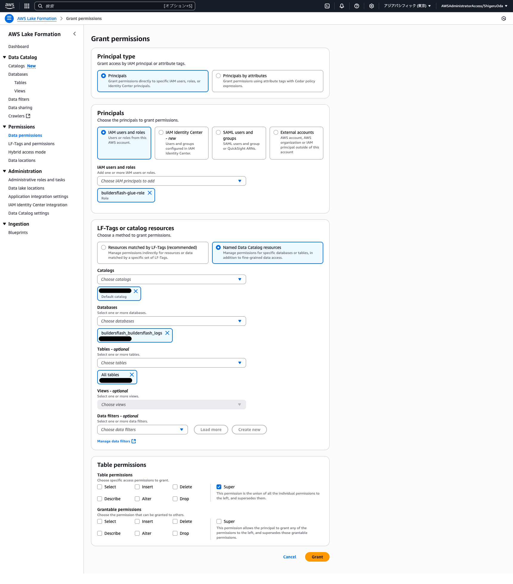

# （オプション）データ拡張

### ECS の TASK 数を 0 に設定

```
aws ecs update-service \
  --cluster buildersflash-api-service \
  --service buildersflash-api-service \
  --desired-count 0
```

### データ拡張

約 50 万件のデータを用意していますので、データ拡張したい場合には以下データを利用下さい。
やりすぎるとコストに跳ねますのでご注意ください

```
# Localにダウンロード
curl -O https://d3ftdlmgxwxkod.cloudfront.net/api-logs-parquet.tar.gz
curl -O https://d1dd1f78xcaeij.cloudfront.net/api-logs-json.tar.gz

# 解凍・展開
tar -xzvf api-logs-parquet.tar.gz
tar -xzvf api-logs-json.tar.gz

# 削除
rm api-logs-parquet.tar.gz
rm api-logs-json.tar.gz

# フォルダ名を変数設定
PARQUET_S3_BUCKET_NAME="buildersflash-api-logs-parquet-f17f6kjd" # ここを更新
JSON_S3_BUCKET_NAME="buildersflash-api-logs-json-f17f6kjd" # ここを更新

# フォルダをS3にアップロード
aws s3 cp ./api-logs-parquet s3://${PARQUET_S3_BUCKET_NAME}/api-logs-parquet/year=2025/month=07/day=01/ --recursive
aws s3 cp s3://${PARQUET_S3_BUCKET_NAME}/api-logs-parquet/year=2025/month=07/day=01/ s3://${PARQUET_S3_BUCKET_NAME}/api-logs-parquet/year=2025/month=07/day=02/ --recursive
aws s3 cp s3://${PARQUET_S3_BUCKET_NAME}/api-logs-parquet/year=2025/month=07/day=01/ s3://${PARQUET_S3_BUCKET_NAME}/api-logs-parquet/year=2025/month=07/day=03/ --recursive
aws s3 cp s3://${PARQUET_S3_BUCKET_NAME}/api-logs-parquet/year=2025/month=07/day=01/ s3://${PARQUET_S3_BUCKET_NAME}/api-logs-parquet/year=2025/month=07/day=04/ --recursive
aws s3 cp s3://${PARQUET_S3_BUCKET_NAME}/api-logs-parquet/year=2025/month=07/day=01/ s3://${PARQUET_S3_BUCKET_NAME}/api-logs-parquet/year=2025/month=07/day=05/ --recursive
aws s3 cp s3://${PARQUET_S3_BUCKET_NAME}/api-logs-parquet/year=2025/month=07/day=01/ s3://${PARQUET_S3_BUCKET_NAME}/api-logs-parquet/year=2025/month=07/day=06/ --recursive

aws s3 cp ./api-logs-json s3://${JSON_S3_BUCKET_NAME}/api-logs-json/year=2025/month=07/day=01/ --recursive
aws s3 cp s3://${JSON_S3_BUCKET_NAME}/api-logs-json/year=2025/month=07/day=01/ s3://${JSON_S3_BUCKET_NAME}/api-logs-json/year=2025/month=07/day=02/ --recursive
aws s3 cp s3://${JSON_S3_BUCKET_NAME}/api-logs-json/year=2025/month=07/day=01/ s3://${JSON_S3_BUCKET_NAME}/api-logs-json/year=2025/month=07/day=03/ --recursive
aws s3 cp s3://${JSON_S3_BUCKET_NAME}/api-logs-json/year=2025/month=07/day=01/ s3://${JSON_S3_BUCKET_NAME}/api-logs-json/year=2025/month=07/day=04/ --recursive
aws s3 cp s3://${JSON_S3_BUCKET_NAME}/api-logs-json/year=2025/month=07/day=01/ s3://${JSON_S3_BUCKET_NAME}/api-logs-json/year=2025/month=07/day=05/ --recursive
aws s3 cp s3://${JSON_S3_BUCKET_NAME}/api-logs-json/year=2025/month=07/day=01/ s3://${JSON_S3_BUCKET_NAME}/api-logs-json/year=2025/month=07/day=06/ --recursive
```

### S3 上のデータ調査

#### json

- 1 日辺り、91 ファイル（非圧縮）
- 最小サイズ 4.1KB
- 最大サイズ 13.1MB
- 合計サイズ 527.4MB
- これを 31 日分を用意 15.9GB

#### parquet

- 1 日辺り、91 ファイル
- 最小サイズ 4.7KB
- 最大サイズ 1.3MB
- 合計サイズ 52.6MB
- これを 31 日分を用意 1.5GB

#### iceberg

- 1 日辺り、11 ファイル
- 最小サイズ 2.8MB
- 最大サイズ 16.2MB
- 合計サイズ 63.5MB
- これを 31 日分を用意 1.9GB

### Athena での検索

以降は私のデータでの検索結果です。

#### SELECT count(\*) FROM TABLE;

|                       | api_logs_json | api_logs_json_express | api_logs_parquet | api_logs_parquet_express | api_logs_iceberg |
| :-------------------- | :------------ | :-------------------- | :--------------- | :----------------------- | :--------------- |
| ScanSize              | 15.97 GB      | 15.97 GB              | -                | -                        |                  |
| 実行時間１（秒）      | 2.985         | 4.646                 | 4.281            | 2.162                    | 1.523            |
| 実行時間２（秒）      | 4.135         | 4.619                 | 4.109            | 2.543                    | 1.783            |
| 実行時間３（秒）      | 3.217         | 5.527                 | 2.718            | 2.553                    | 1.645            |
| 実行時間４（秒）      | 3.717         | 3.797                 | 3.299            | 2.358                    | 1.162            |
| 実行時間５（秒）      | 3.613         | 9.164                 | 3.489            | 2.373                    | 1.659            |
| 実行時間６（秒）      | 3.247         | 4.523                 | 4.292            | 2.681                    | 1.681            |
| 実行時間７（秒）      | 2.871         | 3.855                 | 2.73             | 1.811                    | 1.427            |
| 実行時間８（秒）      | 2.854         | 3.251                 | 3.736            | 4.306                    | 1.752            |
| 実行時間９（秒）      | 3.627         | 5.361                 | 4.958            | 3.134                    | 1.109            |
| 実行時間１０（秒）    | 3.195         | 4.762                 | 5.84             | 2.58                     | 2.136            |
| 平均実行時間（秒）    | 3.3461        | 4.9505                | 3.9452           | 2.6501                   | 1.5877           |
| 比較 vs api_logs_json | 100%          | 148%                  | 118%             | 79%                      | 47%              |

#### SELECT count(region) FROM TABLE WHERE "region" = 'ap-northeast-1';

|                       | api_logs_json | api_logs_json_express | api_logs_parquet | api_logs_parquet_express | api_logs_iceberg |
| :-------------------- | :------------ | :-------------------- | :--------------- | :----------------------- | :--------------- |
| ScanSize              | 15.97 GB      | 15.97 GB              | 39.45 MB         | 39.45 MB                 | 3.97 MB          |
| 実行時間１（秒）      | 5.653         | 5.471                 | 2.783            | 2.763                    | 2.186            |
| 実行時間２（秒）      | 5.233         | 4.648                 | 2.908            | 3.415                    | 1.693            |
| 実行時間３（秒）      | 5.034         | 5.06                  | 4.201            | 2.644                    | 2.477            |
| 実行時間４（秒）      | 6.155         | 4.598                 | 2.776            | 2.899                    | 1.969            |
| 実行時間５（秒）      | 5.42          | 7.711                 | 3.305            | 2.711                    | 2.006            |
| 実行時間６（秒）      | 6.182         | 6.172                 | 2.687            | 2.465                    | 1.156            |
| 実行時間７（秒）      | 5.074         | 6.003                 | 3.136            | 2.906                    | 1.975            |
| 実行時間８（秒）      | 5.551         | 4.534                 | 3.125            | 2.732                    | 1.793            |
| 実行時間９（秒）      | 5.802         | 6.756                 | 3.107            | 2.664                    | 2.52             |
| 実行時間１０（秒）    | 7.545         | 6.631                 | 4.546            | 2.971                    | 2.159            |
| 平均実行時間（秒）    | 5.7649        | 5.7584                | 3.2574           | 2.817                    | 1.9934           |
| 比較 vs api_logs_json | 100%          | 100%                  | 57%              | 49%                      | 35%              |

#### SELECT count(day) FROM TABLE WHERE "year" = '2025' AND "month" = '07' AND "day" = '01';

|                       | api_logs_json | api_logs_json_express | api_logs_parquet | api_logs_parquet_express | api_logs_iceberg |
| :-------------------- | :------------ | :-------------------- | :--------------- | :----------------------- | :--------------- |
| ScanSize              | 527.41 MB     | 527.41 MB             | -                | -                        | 0.06 KB          |
| 実行時間１（秒）      | 0.838         | 1.235                 | 0.524            | 1.848                    | 1.499            |
| 実行時間２（秒）      | 0.696         | 2.562                 | 0.573            | 0.839                    | 1.687            |
| 実行時間３（秒）      | 0.784         | 1.071                 | 0.46             | 0.576                    | 1.535            |
| 実行時間４（秒）      | 0.63          | 2.999                 | 0.667            | 1.831                    | 1.054            |
| 実行時間５（秒）      | 0.778         | 1.464                 | 0.648            | 0.485                    | 3.047            |
| 実行時間６（秒）      | 0.709         | 1.323                 | 0.713            | 0.813                    | 0.987            |
| 実行時間７（秒）      | 0.918         | 1.421                 | 0.596            | 0.945                    | 3.205            |
| 実行時間８（秒）      | 0.807         | 2.134                 | 0.644            | 0.861                    | 1.455            |
| 実行時間９（秒）      | 1.755         | 1.476                 | 0.566            | 0.946                    | 2.436            |
| 実行時間１０（秒）    | 0.912         | 1.25                  | 0.677            | 0.85                     | 0.891            |
| 平均実行時間（秒）    | 0.8827        | 1.6935                | 0.6068           | 0.9994                   | 1.7796           |
| 比較 vs api_logs_json | 100%          | 192%                  | 69%              | 113%                     | 202%             |

#### SELECT count(request_body.instrument) FROM TABLE WHERE request_body.instrument = 'USDJPY';

|                       | api_logs_json | api_logs_json_express | api_logs_parquet | api_logs_parquet_express | api_logs_iceberg |
| :-------------------- | :------------ | :-------------------- | :--------------- | :----------------------- | :--------------- |
| ScanSize              | 15.97 GB      | 15.97 GB              | 28.54 MB         | 28.54 MB                 | 5.89 MB          |
| 実行時間１（秒）      | 5.208         | 5.88                  | 2.877            | 2.991                    | 1.685            |
| 実行時間２（秒）      | 7.72          | 5.141                 | 3.508            | 2.827                    | 1.371            |
| 実行時間３（秒）      | 6.324         | 4.954                 | 3.936            | 3.019                    | 1.29             |
| 実行時間４（秒）      | 5.335         | 8.083                 | 2.712            | 3.187                    | 1.905            |
| 実行時間５（秒）      | 6.275         | 9.283                 | 4.074            | 2.601                    | 1.356            |
| 実行時間６（秒）      | 5.385         | 10.568                | 3.235            | 2.779                    | 2.915            |
| 実行時間７（秒）      | 5.607         | 11.184                | 3.314            | 3.548                    | 2.832            |
| 実行時間８（秒）      | 6.006         | 5.919                 | 2.795            | 2.466                    | 1.552            |
| 実行時間９（秒）      | 5.25          | 6.253                 | 2.749            | 2.866                    | 1.695            |
| 実行時間１０（秒）    | 7.368         | 4.562                 | 4.504            | 2.896                    | 1.42             |
| 平均実行時間（秒）    | 6.0478        | 7.1827                | 3.3704           | 2.918                    | 1.8021           |
| 比較 vs api_logs_json | 100%          | 119%                  | 56%              | 48%                      | 30%              |

### buildersflash-glue-role に権限付与

Lake Formation -> Data permissions -> Grant


### Glue で統計情報を取得

AWS Glue -> Tables -> テーブル名 -> Column statistics -> Generate statistics on demand -> All columns
Role は buildersflash-glue-role を選択してください

S3 Express One Zone は残念ながらサポート対象外です（のようです）

### Athena での検索（統計後）

#### SELECT count(\*) FROM TABLE;

|                        | api_logs_json | api_logs_parquet | api_logs_iceberg |
| :--------------------- | :------------ | :--------------- | :--------------- |
| ScanSize               | 15.97 GB      | -                | -                |
| 実行時間１（秒）       | 5.608         | 3.338            | 2.51             |
| 実行時間２（秒）       | 5.056         | 3.841            | 2.389            |
| 実行時間３（秒）       | 4.453         | 3.411            | 1.807            |
| 実行時間４（秒）       | 4.906         | 5.222            | 2.259            |
| 実行時間５（秒）       | 4.847         | 3.054            | 1.742            |
| 実行時間６（秒）       | 5.14          | 5.457            | 1.93             |
| 実行時間７（秒）       | 3.559         | 3.517            | 1.048            |
| 実行時間８（秒）       | 3.792         | 4.003            | 1.948            |
| 実行時間９（秒）       | 3.671         | 5.963            | 1.664            |
| 実行時間１０（秒）     | 6.716         | 6.55             | 1.049            |
| 平均実行時間（秒）     | 4.7748        | 4.4356           | 1.8346           |
| 比較 vs api_logs_json  | 100%          | 93%              | 38%              |
| 平均実行時間（統計前） | 3.3461        | 3.9452           | 1.5877           |
| 比較 vs 統計前         | 143%          | 112%             | 116%             |

#### SELECT count(region) FROM TABLE WHERE "region" = 'ap-northeast-1';

|                        | api_logs_json | api_logs_parquet | api_logs_iceberg |
| :--------------------- | :------------ | :--------------- | :--------------- |
| ScanSize               | 15.97 GB      | 39.45 MB         | 3.97 MB          |
| 実行時間１（秒）       | 6.081         | 2.71             | 1.846            |
| 実行時間２（秒）       | 4.801         | 4.713            | 2.956            |
| 実行時間３（秒）       | 4.696         | 2.93             | 2.042            |
| 実行時間４（秒）       | 3.848         | 4.046            | 3.165            |
| 実行時間５（秒）       | 4.258         | 3.051            | 1.24             |
| 実行時間６（秒）       | 6.015         | 2.84             | 2.027            |
| 実行時間７（秒）       | 4.599         | 4.274            | 3.838            |
| 実行時間８（秒）       | 5.39          | 3.743            | 2.208            |
| 実行時間９（秒）       | 4.374         | 4.592            | 2.046            |
| 実行時間１０（秒）     | 5.366         | 3.499            | 2.266            |
| 平均実行時間（秒）     | 4.9428        | 3.6398           | 2.3634           |
| 比較 vs api_logs_json  | 100%          | 74%              | 48%              |
| 平均実行時間（統計前） | 5.7649        | 3.2574           | 1.9934           |
| 比較 vs 統計前         | 86%           | 112%             | 119%             |

#### SELECT count(day) FROM TABLE WHERE "year" = '2025' AND "month" = '07' AND "day" = '01';

|                        | api_logs_json | api_logs_parquet | api_logs_iceberg |
| :--------------------- | :------------ | :--------------- | :--------------- |
| ScanSize               | 527.41 MB     | -                | 0.06 KB          |
| 実行時間１（秒）       | 1.301         | 0.784            | 2.335            |
| 実行時間２（秒）       | 1.022         | 0.701            | 1.265            |
| 実行時間３（秒）       | 0.94          | 0.685            | 1.423            |
| 実行時間４（秒）       | 1.008         | 0.79             | 1.484            |
| 実行時間５（秒）       | 1.74          | 0.7              | 1.41             |
| 実行時間６（秒）       | 0.851         | 0.707            | 0.884            |
| 実行時間７（秒）       | 1.041         | 0.717            | 1.503            |
| 実行時間８（秒）       | 0.991         | 0.692            | 1.147            |
| 実行時間９（秒）       | 1.095         | 1.581            | 1.028            |
| 実行時間１０（秒）     | 1.02          | 0.686            | 1.651            |
| 平均実行時間（秒）     | 1.1009        | 0.8043           | 1.413            |
| 比較 vs api_logs_json  | 100%          | 73%              | 128%             |
| 平均実行時間（統計前） | 0.8827        | 0.6068           | 1.7796           |
| 比較 vs 統計前         | 125%          | 133%             | 79%              |

#### SELECT count(request_body.instrument) FROM TABLE WHERE request_body.instrument = 'USDJPY';

|                        | api_logs_json | api_logs_parquet | api_logs_iceberg |
| :--------------------- | :------------ | :--------------- | :--------------- |
| ScanSize               | 15.97 GB      | 28.54 MB         | 5.89 MB          |
| 実行時間１（秒）       | 7.01          | 3.91             | 4.99             |
| 実行時間２（秒）       | 5.496         | 3.598            | 2.127            |
| 実行時間３（秒）       | 6.366         | 2.908            | 3.081            |
| 実行時間４（秒）       | 5.484         | 3.076            | 2.435            |
| 実行時間５（秒）       | 5.894         | 3.023            | 2.503            |
| 実行時間６（秒）       | 5.378         | 3.964            | 1.985            |
| 実行時間７（秒）       | 5.45          | 3.502            | 2.778            |
| 実行時間８（秒）       | 6.215         | 2.988            | 2.004            |
| 実行時間９（秒）       | 6.512         | 3.059            | 4.002            |
| 実行時間１０（秒）     | 6.484         | 3.35             | 3.02             |
| 平均実行時間（秒）     | 6.0289        | 3.3378           | 2.8925           |
| 比較 vs api_logs_json  | 100%          | 55%              | 48%              |
| 平均実行時間（統計前） | 6.0478        | 3.3704           | 1.8021           |
| 比較 vs 統計前         | 100%          | 99%              | 161%             |

## まとめ・考察

同一データを JSON・Parquet・Iceberg 形式で S3 に格納し、Athena および Glue を用いてクエリ実行時間を比較しました。
また、Glue による統計情報の有無によるパフォーマンス変化も観察しました。

### 1. ストレージ形式ごとの特徴とパフォーマンス

#### JSON 形式

可搬性が高く扱いやすい一方で、クエリ実行時のパフォーマンスは最も低く、スキャンデータ量・コストも大きくなりがちです。

#### Parquet 形式

列指向・圧縮により、JSON と比較してクエリ実行時間・コストが大幅に削減されました。特に全件集計や特定カラムの集計で効果が顕著です。

#### Iceberg 形式

Parquet をさらにテーブル管理・スナップショット・パーティション管理で拡張した形式。今回の検証では最もクエリ実行時間が短く、効率的なデータ分析が可能でした。

### 2. Glue 統計情報の効果

Glue でカラム統計情報を生成した場合、全体的にクエリ実行時間が増加する傾向が見られました（特に JSON 形式）。
これは、統計情報の活用によりクエリプランが変化し、場合によっては最適化が効かないケースがあるためと考えられます。
ただし、パーティションプルーニングや特定条件での集計では、Parquet や Iceberg で統計情報の恩恵を受ける場合もあります。

### 3. コスト・運用面の考察

#### データ量・コスト

JSON 形式はデータ量が大きく、Athena のスキャンコストも高くなります。Parquet や Iceberg を利用することで、ストレージ・クエリコストの両面で大幅な削減が期待できます。

#### コスト比較の目安

今回の検証では、Parquet 形式にすることでスキャンデータ量・クエリコストが JSON 形式の約 1/10 以下に削減されました。

### 4. 推奨パターン

#### 小規模・簡易用途

JSON 形式でも十分ですが、コスト・パフォーマンスを考慮すると Parquet 推奨。

#### 大規模・運用重視

Iceberg 形式を推奨。Glue 統計情報も活用しつつ、クエリパターンに応じて最適化を検討してください。

## 補足

クエリ内容やデータ分布、パーティション設計によって最適な形式や統計情報の有無は変わります。
