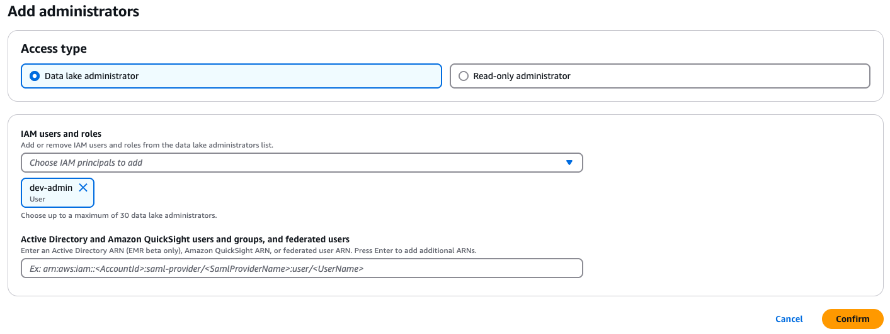
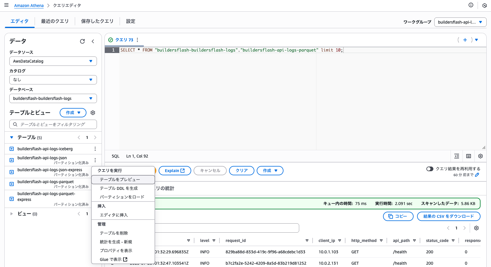
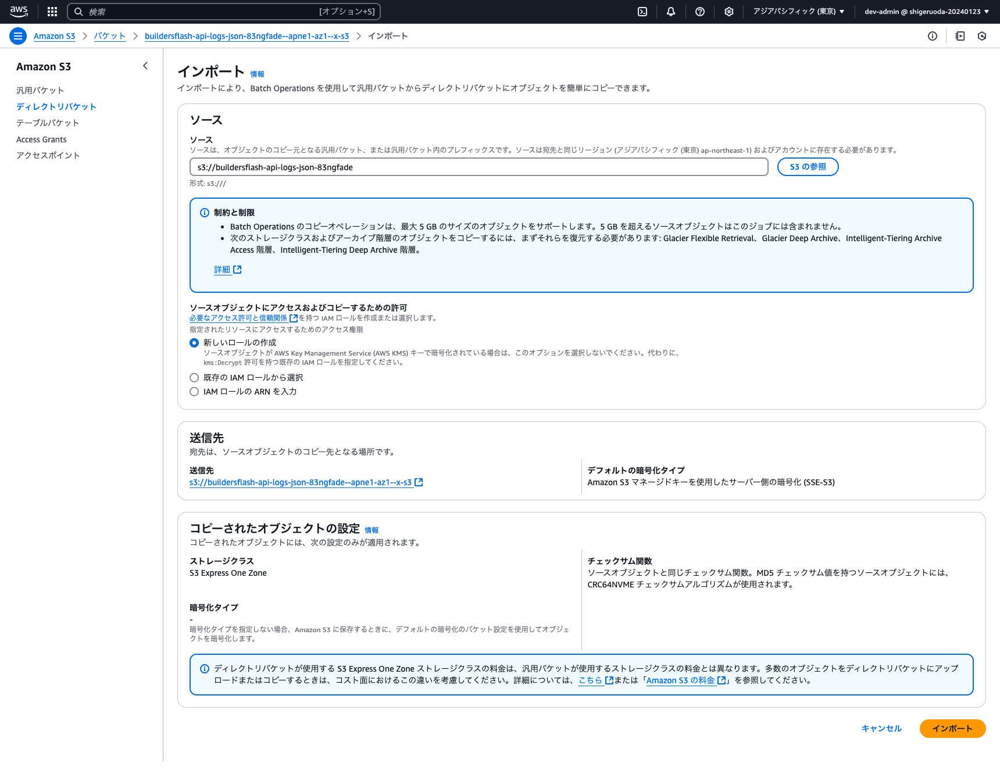
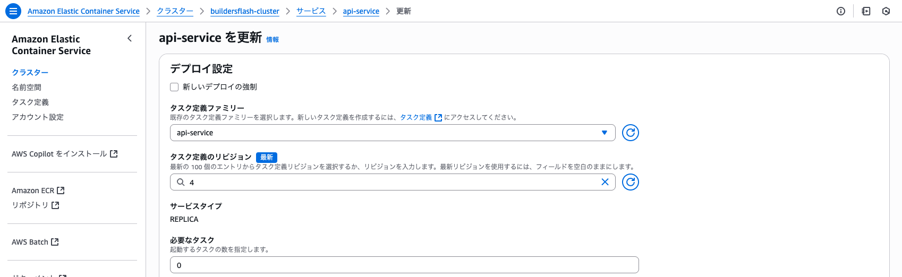

# jawsug-bgnr-66

[JAWS-UG 初心者支部#66 hands-on](https://jawsug-bgnr.connpass.com/event/360104/)  
[builders.flash](https://aws.amazon.com/jp/builders-flash/202506/comparison-s3-starndard-express-one-zone/)

## 構成図

ECS で作成される log を各種 S3 に保存して、Athena で検索することを体験するハンズオンです  


## 環境構築手順

### Install AWS CLI（未 Install の場合）

リンク先の手順書を参考に AWS CLI を Install をして下さい
https://docs.aws.amazon.com/ja_jp/cli/latest/userguide/getting-started-install.html

私の Version は以下で利用しています

```
% aws --version
aws-cli/2.27.12 Python/3.13.3 Darwin/24.4.0 exe/x86_64
```

### Install Terraform（未 Install の場合）

リンク先の手順書を参考に Terraform を Install をして下さい  
https://developer.hashicorp.com/terraform/tutorials/aws-get-started/install-cli

私の Version は以下で利用しています

```
% terraform --version
Terraform v1.11.4
on darwin_arm64
```

### Install git（未 Install の場合）

リンク先の手順書を参考に git を Install をして下さい  
https://git-scm.com/downloads

私の Version は以下で利用しています

```
% git --version
git version 2.49.0
```

### git clone

```

git clone https://github.com/shigeru-oda/jawsug-bgnr-66.git
cd jawsug-bgnr-66

```

### tfstate 用の S3 を作成

```bash
YOUR_NAME="shigeruoda" <- ここを更新

CURRENT_TIME=$(date +"%Y%m%d%H%M%S")
BUCKET_NAME="tfstate-${YOUR_NAME}-${CURRENT_TIME}"
echo "$BUCKET_NAME"

aws s3api create-bucket \
  --bucket "$BUCKET_NAME" \
  --region ap-northeast-1 \
  --create-bucket-configuration LocationConstraint=ap-northeast-1
```

### main.tf を変更

`./terraform/main.tf`の 3 行目を変更

```./terraform/main.tf
terraform {
  backend "s3" {
    bucket  = "tfstate-shigeruoda-20250720095822" <- ここを更新
    key     = "terraform.tfstate"
    region  = "ap-northeast-1"
    encrypt = true
  }
}
```

### Data Lake 管理者を設定

- [AWS コンソールで AWS Lake Formation に移動](https://ap-northeast-1.console.aws.amazon.com/lakeformation/home?region=ap-northeast-1#firstRun)
- 左ペインの `Administrative roles and tasks` を開く
- `Data lake administrators` セクションで `Add` をクリック
- Access type で`Data lake administrator`を選択し、IAM users and roles は自身の USER/Role を選択し、`Confirm`をクリック
  

### terraform 適用（ROLE 作成）

```
cd ./terraform/
terraform init
terraform apply -target=aws_iam_role.glue_role -target=aws_iam_role.firehose_role
-> yes
```

### Data Lake 管理者を設定

- [AWS コンソールで AWS Lake Formation に移動](https://ap-northeast-1.console.aws.amazon.com/lakeformation/home?region=ap-northeast-1#firstRun)
- 左ペインの `Administrative roles and tasks` を開く
- `Data lake administrators` セクションで `Add` をクリック
- Access type で`Data lake administrator`を選択し、`buildersflash-firehose-role`と`buildersflash-glue-role` を選択し、`Confirm`をクリック

### terraform 適用（残り）

```
terraform apply
-> yes
-> 5分ほどかかります
```

### docker image の build & push

```
cd ../docker/
./ecr-push.sh
```

### ECS の TASK 数を 1 に設定

```
aws ecs update-service \
  --cluster buildersflash-api-service \
  --service buildersflash-api-service \
  --desired-count 1
```

- [AWS コンソールで ECS に移動](https://ap-northeast-1.console.aws.amazon.com/ecs/v2/clusters/buildersflash-api-service/services/buildersflash-api-service/health?region=ap-northeast-1)
- タスクが１個起動していることを確認

### API へのアクセス

API のアクセス確認で API が通ることを確認します

```
# DNS名取得
ALB_DNS=$(aws elbv2 describe-load-balancers --names buildersflash-api-service --region ap-northeast-1 --query 'LoadBalancers[0].DNSName' --output text)
echo $ALB_DNS

# health
curl -X GET http://$ALB_DNS/health
-> {"status":"healthy"}

```

### Athena での検索

- [AWS コンソールで Amazon Athena へ移動](https://ap-northeast-1.console.aws.amazon.com/athena/home?region=ap-northeast-1)
- ワークグループを`buildersflash-api-logs`を選択
- データソースは`AwsDataCatalog`を選択
- カタログは`なし`を選択
- データベースは`buildersflash-buildersflash-logs`を選択

- テーブルは `buildersflash-api-logs-json` または `buildersflash-api-logs-parquet`で`テーブルをプレビュー`を押下することで、10 件表示されます。
- 好きな条件で検索を行ってみてください。



### Amazon S3 Express One Zone への反映

Amazon Data Firehose からは Amazon S3 Standard のみに反映されるため、Amazon S3 Express One Zone にコンソールから反映を行います

- [AWS コンソールで Amazon S3 へ移動](https://ap-northeast-1.console.aws.amazon.com/s3/get-started?region=ap-northeast-1)
- 左ペインから`ディレクトリバケット`を選択、以下 2 つのバケットがあります。
  - buildersflash-api-logs-json-xxxxxxxx--apne1-az1--x-s3
  - buildersflash-api-logs-parquet-xxxxxxxx--apne1-az1--x-s3
- 一つのバケットのチェックボックスを入れて、`インポート`を押下
  [](./img/img03.png)
- インポート元の汎用バケットは以下です。json と parquet を合わせて`インポート`を押下
  - buildersflash-api-logs-json-xxxxxxxx
  - buildersflash-api-logs-parquet-xxxxxxxx
    
- json と parquet の両方のバケット分を繰り返します

### iceberg への反映

parquet のデータから medata を作成し、iceberg 形式にします。

- [AWS コンソールで AWS Athena へ移動](https://ap-northeast-1.console.aws.amazon.com/athena/home?region=ap-northeast-1#/query-editor/saved-queries)
- `buildersflash_create_iceberg_table`を選択実行
- `buildersflash_insert_iceberg_table`を選択実行

## 環境削除

### ECS を停止

ECS の`必要なタスク数`を 0 にして、サービスを停止します


### コンソールから削除

中身があると削除できないリソースはコンソールから削除します

- ECR
  - buildersflash-api-service
- S3 Standard
  - buildersflash-api-logs-json-xxxxxxxx
  - buildersflash-api-logs-parquet-xxxxxxxx
  - buildersflash-api-logs-iceberg-xxxxxxxx
  - buildersflash-athena-query-results-xxxxxxxx
- S3 Express One Zone
  - buildersflash-api-logs-json-xxxxxxxx--apne1-az1--x-s3
  - buildersflash-api-logs-parquet-xxxxxxxx--apne1-az1--x-s3
- Athena
  - ワークグループ
    - buildersflash-api-logs


### terraform から削除

terraform destroy でリソースを削除します

```
cd ./terraform
terraform destroy
-> yes
```

### tfstate 用の S3 削除

tfstate 用の S3 を削除します


- S3 Standard
  - "tfstate-${YOUR_NAME}-${CURRENT_TIME}"


### Data Lake 管理者解除

Data Lake 管理者を設定を解除します

- AWS Lake Formation
  - Data lake administrators
    - 自身の USER/Role
    - `buildersflash-firehose-role`
    - `buildersflash-glue-role`

