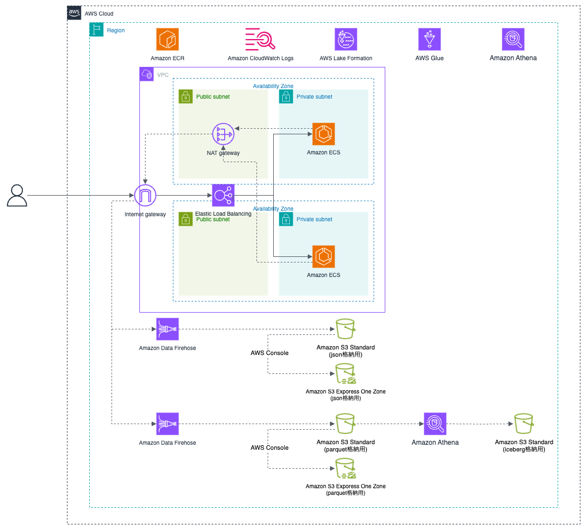

# jawsug-bgnr-66

[JAWS-UG 初心者支部#66 hands-on](https://jawsug-bgnr.connpass.com/event/360104/)  
[builders.flash](https://aws.amazon.com/jp/builders-flash/202506/comparison-s3-starndard-express-one-zone/)

## 構成図

ECS で作成される log を各種 S3 に保存して、Athena で検索することを体験するハンズオンです  


## 環境構築手順

### Install AWS CLI（未 Install の場合）

リンク先の手順書を参考に AWS CLI を Install をして下さい
https://docs.aws.amazon.com/ja_jp/cli/latest/userguide/getting-started-install.html

私の Version は以下で利用しています

```
% aws --version
aws-cli/2.27.12 Python/3.13.3 Darwin/24.4.0 exe/x86_64
```

### Install Terraform（未 Install の場合）

リンク先の手順書を参考に Terraform を Install をして下さい  
https://developer.hashicorp.com/terraform/tutorials/aws-get-started/install-cli

macでAppleSilicon.comで利用 最新のM1〜M3でTerraform入れれない方には  
`ターミナル右クリックでRosetta利用にチェック`  
それでもInstallできない方は `arch −arm64 brew install terraform`を試してみてください

私の Version は以下で利用しています

```
% terraform --version
Terraform v1.12.2
on darwin_arm64
+ provider registry.terraform.io/hashicorp/aws v6.3.0
+ provider registry.terraform.io/hashicorp/random v3.7.2
```

### Install docker（未 Install の場合）

リンク先の手順書を参考に docker を Install をして下さい  
https://docs.docker.com/desktop/

私の Version は以下で利用しています

```
% docker --version
Docker version 28.1.1, build 4eba377
```

### Install git（未 Install の場合）

リンク先の手順書を参考に git を Install をして下さい  
https://git-scm.com/downloads

私の Version は以下で利用しています

```
% git --version
git version 2.49.0
```

### git clone

```

git clone https://github.com/shigeru-oda/jawsug-bgnr-66.git
cd jawsug-bgnr-66

```

### tfstate 用の S3 を作成

```bash
YOUR_NAME="shigeruoda" <- ここを更新

CURRENT_TIME=$(date +"%Y%m%d%H%M%S")
BUCKET_NAME="tfstate-${YOUR_NAME}-${CURRENT_TIME}"
echo "$BUCKET_NAME"

aws s3api create-bucket \
  --bucket "$BUCKET_NAME" \
  --region ap-northeast-1 \
  --create-bucket-configuration LocationConstraint=ap-northeast-1
```

### main.tf を変更

`./terraform/main.tf`の 3 行目を変更

```./terraform/main.tf
terraform {
  backend "s3" {
    bucket  = "tfstate-shigeruoda-20250720095822" <- ここを更新
    key     = "terraform.tfstate"
    region  = "ap-northeast-1"
    encrypt = true
  }
}
```

### Data Lake 管理者を設定

- [AWS コンソールで AWS Lake Formation に移動](https://ap-northeast-1.console.aws.amazon.com/lakeformation/home?region=ap-northeast-1#firstRun)
- 左ペインの `Administrative roles and tasks` を開く
- `Data lake administrators` セクションで `Add` をクリック
- Access type で`Data lake administrator`を選択し、IAM users and roles は自身の USER/Role を選択し、`Confirm`をクリック
  

### terraform 適用（ROLE 作成）

```
cd ./terraform/
terraform init
terraform apply -target=aws_iam_role.glue_role -target=aws_iam_role.firehose_role
-> yes
```

### Data Lake 管理者を設定

- [AWS コンソールで AWS Lake Formation に移動](https://ap-northeast-1.console.aws.amazon.com/lakeformation/home?region=ap-northeast-1#firstRun)
- 左ペインの `Administrative roles and tasks` を開く
- `Data lake administrators` セクションで `Add` をクリック
- Access type で`Data lake administrator`を選択し、`buildersflash-firehose-role`と`buildersflash-glue-role` を選択し、`Confirm`をクリック

### terraform 適用（残り）

```
terraform apply
-> yes
-> 5分ほどかかります
```

### docker image の build & push

```
cd ../docker/
./ecr-push.sh
```

### ECS の TASK 数を 1 に設定

```
aws ecs update-service \
  --cluster buildersflash-api-service \
  --service buildersflash-api-service \
  --desired-count 1
```

- [AWS コンソールで ECS に移動](https://ap-northeast-1.console.aws.amazon.com/ecs/v2/clusters/buildersflash-api-service/services/buildersflash-api-service/health?region=ap-northeast-1)
- タスクが１個起動していることを確認

### API へのアクセス

API のアクセス確認で API が通ることを確認します

```
# DNS名取得


# health
curl -X GET http://$ALB_DNS/health
-> {"status":"healthy"}

```

### Athena での検索

- [AWS コンソールで Amazon Athena へ移動](https://ap-northeast-1.console.aws.amazon.com/athena/home?region=ap-northeast-1)
- ワークグループを`buildersflash-api-logs`を選択
- データソースは`AwsDataCatalog`を選択
- カタログは`なし`を選択
- データベースは`buildersflash-buildersflash-logs`を選択

- テーブルは `buildersflash-api-logs-json` または `buildersflash-api-logs-parquet`で`テーブルをプレビュー`を押下することで、10 件表示されます。
- 好きな条件で検索を行ってみてください。


### Amazon S3 Express One Zone への反映

Amazon Data Firehose からは Amazon S3 Standard のみに反映されるため、Amazon S3 Express One Zone にコンソールから反映を行います

- [AWS コンソールで Amazon S3 へ移動](https://ap-northeast-1.console.aws.amazon.com/s3/get-started?region=ap-northeast-1)
- 左ペインから`ディレクトリバケット`を選択、以下 2 つのバケットがあります。
  - buildersflash-api-logs-json-xxxxxxxx--apne1-az1--x-s3
  - buildersflash-api-logs-parquet-xxxxxxxx--apne1-az1--x-s3
- 一つのバケットのチェックボックスを入れて、`インポート`を押下
  [](./img/img03.png)
- インポート元の汎用バケットは以下です。json と parquet を合わせて`インポート`を押下
  - buildersflash-api-logs-json-xxxxxxxx
  - buildersflash-api-logs-parquet-xxxxxxxx
    
- json と parquet の両方のバケット分を繰り返します

### iceberg への反映

parquet のデータから medata を作成し、iceberg 形式にします。

- [AWS コンソールで AWS Athena へ移動](https://ap-northeast-1.console.aws.amazon.com/athena/home?region=ap-northeast-1#/query-editor/saved-queries)
- `buildersflash_create_iceberg_table`を選択実行
- `buildersflash_insert_iceberg_table`を選択実行

## （オプション）データ拡張

### データ拡張

約 50 万件のデータを用意していますので、データ拡張したい場合には以下データを利用下さい。
やりすぎるとコストに跳ねますのでご注意ください

```
# Localにダウンロード
curl -O https://d3ftdlmgxwxkod.cloudfront.net/api-logs-parquet.tar.gz
curl -O https://d1dd1f78xcaeij.cloudfront.net/api-logs-json.tar.gz

# 解凍・展開
tar -xzvf api-logs-parquet.tar.gz
tar -xzvf api-logs-json.tar.gz

# 削除
rm api-logs-parquet.tar.gz
rm api-logs-json.tar.gz

# フォルダ名を変数設定
PARQUET_S3_BUCKET_NAME="buildersflash-api-logs-parquet-f17f6kjd" # ここを更新
JSON_S3_BUCKET_NAME="buildersflash-api-logs-json-f17f6kjd" # ここを更新

# フォルダをS3にアップロード
aws s3 cp ./api-logs-parquet s3://${PARQUET_S3_BUCKET_NAME}/api-logs-parquet/year=2025/month=07/day=01/ --recursive
aws s3 cp s3://${PARQUET_S3_BUCKET_NAME}/api-logs-parquet/year=2025/month=07/day=01/ s3://${PARQUET_S3_BUCKET_NAME}/api-logs-parquet/year=2025/month=07/day=02/ --recursive
aws s3 cp s3://${PARQUET_S3_BUCKET_NAME}/api-logs-parquet/year=2025/month=07/day=01/ s3://${PARQUET_S3_BUCKET_NAME}/api-logs-parquet/year=2025/month=07/day=03/ --recursive
aws s3 cp s3://${PARQUET_S3_BUCKET_NAME}/api-logs-parquet/year=2025/month=07/day=01/ s3://${PARQUET_S3_BUCKET_NAME}/api-logs-parquet/year=2025/month=07/day=04/ --recursive
aws s3 cp s3://${PARQUET_S3_BUCKET_NAME}/api-logs-parquet/year=2025/month=07/day=01/ s3://${PARQUET_S3_BUCKET_NAME}/api-logs-parquet/year=2025/month=07/day=05/ --recursive
aws s3 cp s3://${PARQUET_S3_BUCKET_NAME}/api-logs-parquet/year=2025/month=07/day=01/ s3://${PARQUET_S3_BUCKET_NAME}/api-logs-parquet/year=2025/month=07/day=06/ --recursive

aws s3 cp ./api-logs-json s3://${JSON_S3_BUCKET_NAME}/api-logs-json/year=2025/month=07/day=01/ --recursive
aws s3 cp s3://${JSON_S3_BUCKET_NAME}/api-logs-json/year=2025/month=07/day=01/ s3://${JSON_S3_BUCKET_NAME}/api-logs-json/year=2025/month=07/day=02/ --recursive
aws s3 cp s3://${JSON_S3_BUCKET_NAME}/api-logs-json/year=2025/month=07/day=01/ s3://${JSON_S3_BUCKET_NAME}/api-logs-json/year=2025/month=07/day=03/ --recursive
aws s3 cp s3://${JSON_S3_BUCKET_NAME}/api-logs-json/year=2025/month=07/day=01/ s3://${JSON_S3_BUCKET_NAME}/api-logs-json/year=2025/month=07/day=04/ --recursive
aws s3 cp s3://${JSON_S3_BUCKET_NAME}/api-logs-json/year=2025/month=07/day=01/ s3://${JSON_S3_BUCKET_NAME}/api-logs-json/year=2025/month=07/day=05/ --recursive
aws s3 cp s3://${JSON_S3_BUCKET_NAME}/api-logs-json/year=2025/month=07/day=01/ s3://${JSON_S3_BUCKET_NAME}/api-logs-json/year=2025/month=07/day=06/ --recursive
```

### Athena での検索

以降は私のデータでの検索結果です。

#### SELECT count(\*) FROM TABLE;

|              | api_logs_json | api_logs_json_express | api_logs_parquet | api_logs_parquet_express | api_logs_iceberg |
| :----------- | :------------ | :-------------------- | :--------------- | :----------------------- | :--------------- |
| 件数         | 3,683,449     | 3,683,449             | 3,683,449        | 3,683,449                | 3,683,449        |
| 実行時間１   | 3.04          | 2.54                  | 2.66             | 2.01                     | 2.50             |
| 実行時間２   | 2.38          | 2.93                  | 2.89             | 2.13                     | 1.54             |
| 実行時間３   | 2.32          | 2.43                  | 2.35             | 2.24                     | 0.83             |
| 実行時間４   | 2.64          | 8.51                  | 2.40             | 1.60                     | 1.25             |
| 実行時間５   | 5.29          | 2.70                  | 2.32             | 2.37                     | 1.25             |
| 平均実行時間 | 3.13          | 3.82                  | 2.52             | 2.07                     | 1.47             |

#### SELECT count(\*) FROM TABLE WHERE "region" = 'ap-northeast-1';

|              | api_logs_json | api_logs_json_express | api_logs_parquet | api_logs_parquet_express | api_logs_iceberg |
| :----------- | :------------ | :-------------------- | :--------------- | :----------------------- | :--------------- |
| 件数         | 923,447       | 923,447               | 923,447          | 923,447                  | 923,447          |
| 実行時間１   | 5.59          | 3.33                  | 3.39             | 2.64                     | 1.76             |
| 実行時間２   | 5.04          | 5.38                  | 3.51             | 3.40                     | 3.46             |
| 実行時間３   | 4.63          | 4.71                  | 2.92             | 3.13                     | 2.28             |
| 実行時間４   | 3.80          | 5.43                  | 3.71             | 2.65                     | 1.70             |
| 実行時間５   | 4.32          | 5.74                  | 3.17             | 5.09                     | 1.97             |
| 平均実行時間 | 4.67          | 4.92                  | 3.34             | 3.38                     | 2.23             |

#### SELECT count(\*) FROM TABLE WHERE "year" = '2025' AND "month" = '07' AND "day" = '01';

|              | api_logs_json | api_logs_json_express | api_logs_parquet | api_logs_parquet_express | api_logs_iceberg |
| :----------- | :------------ | :-------------------- | :--------------- | :----------------------- | :--------------- |
| 件数         | 526,207       | 526,207               | 526,207          | 526,207                  | 526,207          |
| 実行時間１   | 0.70          | 1.59                  | 0.66             | 0.81                     | 1.52             |
| 実行時間２   | 0.63          | 2.05                  | 0.75             | 0.90                     | 0.91             |
| 実行時間３   | 0.72          | 1.32                  | 0.61             | 0.77                     | 0.88             |
| 実行時間４   | 0.83          | 1.38                  | 0.58             | 0.77                     | 2.26             |
| 実行時間５   | 0.81          | 1.37                  | 0.60             | 0.87                     | 2.02             |
| 平均実行時間 | 0.74          | 1.54                  | 0.64             | 0.82                     | 1.51             |

### buildersflash-glue-role に権限付与

Lake Formation -> Data permissions -> Grant


### Glue で統計情報を取得

AWS Glue -> Tables -> テーブル名 -> Column statistics -> Generate statistics on demand -> All columns
Role は buildersflash-glue-role を選択してください

S3 Express One Zone は残念ながらサポート対象外です（のようです）

### Athena での検索（統計後）

#### SELECT count(\*) FROM TABLE;

|              | api_logs_json | api_logs_json_express | api_logs_parquet | api_logs_parquet_express | api_logs_iceberg |
| :----------- | :------------ | :-------------------- | :--------------- | :----------------------- | :--------------- |
| 件数         | 3,683,449     | -                     | 3,683,449        | -                        | 3,683,449        |
| 実行時間１   | 3.33          | -                     | 2.65             | -                        | 1.61             |
| 実行時間２   | 2.83          | -                     | 3.22             | -                        | 0.91             |
| 実行時間３   | 2.38          | -                     | 2.67             | -                        | 1.54             |
| 実行時間４   | 2.56          | -                     | 3.90             | -                        | 1.47             |
| 実行時間５   | 2.46          | -                     | 2.52             | -                        | 2.66             |
| 平均実行時間 | 2.71          | -                     | 2.99             | -                        | 1.64             |

#### SELECT count(\*) FROM TABLE WHERE "region" = 'ap-northeast-1';

|              | api_logs_json | api_logs_json_express | api_logs_parquet | api_logs_parquet_express | api_logs_iceberg |
| :----------- | :------------ | :-------------------- | :--------------- | :----------------------- | :--------------- |
| 件数         | 923,447       | -                     | 923,447          | -                        | 923,447          |
| 実行時間１   | 3.68          | -                     | 3.58             | -                        | 1.14             |
| 実行時間２   | 3.40          | -                     | 2.55             | -                        | 2.54             |
| 実行時間３   | 3.92          | -                     | 6.00             | -                        | 2.29             |
| 実行時間４   | 4.68          | -                     | 4.67             | -                        | 1.19             |
| 実行時間５   | 3.57          | -                     | 3.28             | -                        | 1.79             |
| 平均実行時間 | 3.85          | -                     | 4.01             | -                        | 1.79             |

#### SELECT count(\*) FROM TABLE WHERE "year" = '2025' AND "month" = '07' AND "day" = '01';

|              | api_logs_json | api_logs_json_express | api_logs_parquet | api_logs_parquet_express | api_logs_iceberg |
| :----------- | :------------ | :-------------------- | :--------------- | :----------------------- | :--------------- |
| 件数         | 526,207       | -                     | 526,207          | -                        | 526,207          |
| 実行時間１   | 0.95          | -                     | 0.74             | -                        | 1.58             |
| 実行時間２   | 1.04          | -                     | 0.76             | -                        | 1.51             |
| 実行時間３   | 0.83          | -                     | 0.64             | -                        | 0.97             |
| 実行時間４   | 1.03          | -                     | 0.77             | -                        | 2.27             |
| 実行時間５   | 1.08          | -                     | 0.66             | -                        | 0.88             |
| 平均実行時間 | 0.99          | -                     | 0.71             | -                        | 1.44             |

## 環境削除

### ECS を停止

ECS の`必要なタスク数`を 0 にして、サービスを停止します


### コンソールから削除

中身があると削除できないリソースはコンソールから削除します

- ECR
  - buildersflash-api-service
- S3 Standard
  - buildersflash-api-logs-json-xxxxxxxx
  - buildersflash-api-logs-parquet-xxxxxxxx
  - buildersflash-api-logs-iceberg-xxxxxxxx
  - buildersflash-athena-query-results-xxxxxxxx
- S3 Express One Zone
  - buildersflash-api-logs-json-xxxxxxxx--apne1-az1--x-s3
  - buildersflash-api-logs-parquet-xxxxxxxx--apne1-az1--x-s3
- Athena
  - ワークグループ
    - buildersflash-api-logs

### terraform から削除

terraform destroy でリソースを削除します

```
cd ./terraform
terraform destroy
-> yes
```

### tfstate 用の S3 削除

tfstate 用の S3 を削除します

- S3 Standard
  - "tfstate-${YOUR_NAME}-${CURRENT_TIME}"

### Data Lake 管理者解除

Data Lake 管理者を設定を解除します

- AWS Lake Formation
  - Data lake administrators
    - 自身の USER/Role
    - `buildersflash-firehose-role`
    - `buildersflash-glue-role`
