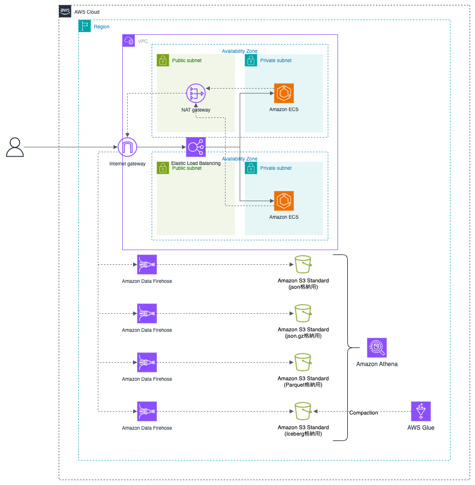

# Amazon Athena で json、Parquet、Iceberg のデータを検索し、性能比較してみた

2025 年 6 月 25 日～ 26 日に開催された AWS Summit Japan 2025 での Community Stage で「[Amazon S3 標準/S3 Tables/S3 Express One Zone を使ったログ分析](https://speakerdeck.com/shigeruoda/s3-express-one-zonewoshi-tutarogufen-xi)」というタイトルで登壇させていただきました。
この時点では具体的な性能比較は行っていなかったので、実際に試してみた結果をレポートします。

# 前提

## システム構成図

検証用のデータを投入するためのシステム構成図です。

[Amazon Elastic Container Service (Amazon ECS)](https://aws.amazon.com/jp/ecs/) から [Amazon Data Firehose](https://aws.amazon.com/jp/firehose/) へデータ送信を行い、[Simple Storage Service (Amazon S3)](https://aws.amazon.com/jp/s3/) 上で形式別に保管（json / json.gz / Parquet / Iceberg）しています。
各種 S3 バケットに格納されたデータを Amazon Athena で検索し、パフォーマンスを比較します。


## データ形式

1 レコード辺り、約 1000 バイトで以下のようなデータを投入しました。

| カラム名         | データ型 | 具体的な値                                |
| :--------------- | :------- | :---------------------------------------- |
| timestamp        | string   | 2025-07-28T10:53:54.638125Z               |
| level            | string   | INFO                                      |
| request_id       | string   | 73215e59-061c-419e-bd2d-bc80b1c9675b      |
| client_ip        | string   | 10.0.1.160                                |
| http_method      | string   | GET                                       |
| api_path         | string   | /health                                   |
| status_code      | int      | 200                                       |
| response_time_ms | int      | 0                                         |
| request_body     | struct   |                                           |
| -> order_id      | string   | ORD-214115324                             |
| -> instrument    | string   | USDJPY                                    |
| -> order_type    | string   | MARKET                                    |
| -> quantity      | int      | 997373                                    |
| -> price         | double   | 102.58                                    |
| -> side          | string   | BUY                                       |
| auth_method      | string   | OAuth2                                    |
| user_agent       | string   | Mozilla/5.0 (Windows NT 10.0; Win64; x64) |
| note             | string   | AAAAAAAAAA...                             |
| environment      | string   | production                                |
| region           | string   | us-east-1                                 |
| ecs_cluster      | string   | buildersflash-api-service                 |
| ecs_service      | string   | api-service                               |
| ecs_task_id      | string   | d5a604b808c34467b9c14836bf6d46e7          |
| year             | string   | 2025                                      |
| month            | string   | 7                                         |
| day              | string   | 20                                        |

## S3 上データの統計情報

Hive 形式で年月日のパーティション構造で保存されており、2025 年 07 月 01 日 〜 2025 年 07 月 31 日までの 31 日分のデータが投入されています。

|         |                          |          json |       json.gz |       Parquet |       Iceberg |
| :------ | :----------------------- | ------------: | ------------: | ------------: | ------------: |
| 1 日分  | ファイル数（件数）       |         7,293 |         7,293 |         7,100 |            30 |
|         | レコード件数（件数）     |    51,119,493 |    51,119,493 |    51,119,493 |    51,119,493 |
|         | 合計ファイルサイズ（GB） |         50.04 |          3.11 |          4.88 |          2.87 |
| 31 日分 | ファイル数（件数）       |       226,083 |       226,083 |       220,100 |           930 |
|         | レコード件数（件数）     | 1,584,704,283 | 1,584,704,283 | 1,584,704,283 | 1,584,704,283 |
|         | 合計ファイルサイズ（GB） |      1,551.10 |         96.36 |        151.43 |         89.03 |

---

# ディレクトリ構成図

## json、json.gz、Parquet の場合

Hive 互換のパーティション設計では、パーティション列（year, month, day）がそのままディレクトリ階層に展開されます。
Athena や Hive 互換エンジンは S3 のディレクトリ構造そのものをパーティション情報として解釈します。

```
s3://bucket/logs/
 └── year=2025/
      └── month=07/
           ├── day=01/
           │    ├── xxxx （json or json.gz or Parquet）
           │    ├── yyyy
           │    └── zzzz
           ├── day=02/
           │    └── ...
           └── day=31/
```

## Iceberg の場合

Query エンジンは最初に `metadata` ディレクトリ配下のファイルを参照します。
metadata には、スキーマ・パーティション・統計情報（min/max、件数情報など）が登録されており、これをもとに必要な `data` 配下ファイルのみを取得します。

```
s3://bucket/logs/
 └── db.table/
      ├── metadata/
      │    ├── metadata file （テーブル定義、スキーマ情報、パーティション情報、最新スナップショットID）
      │    ├── manifest list （スナップショット情報、どの manifest を参照するか、パーティション範囲情報）
      │    └── manifest file （データファイルの一覧、ファイルごとの統計情報（min/max、null件数、レコード数など））
      └── data/
           ├── __8IBg/
           │    └── year=2025/
           │         └── month=07/
           │               └── day=01/
           │                     └── xxxx （Parquet）
           ├── _DFw2w/
           │    └── year=2025/
           │         └── month=07/
           │               └── day=02/
           │                     └── yyyy
           └── DUOncQ/           （全部で930 ディレクトリ）
```

---

# 性能比較

以下、形式別（json / json.gz / Parquet / Iceberg）に 10 回実行した平均値を示します。表の「Iceberg 基準」は、Iceberg を 100% としたときの相対比較です。

## １：１日分の全レコードを取得するクエリ

**結論: このクエリでは各形式間の差は小さく、主に圧縮方式とファイル数の違いが効く。**

```sql
SELECT *
FROM {TABLE_NAME}
WHERE year='2025' AND month='07' AND day='01';
```

| テーブル | 処理時間（秒） | スキャン量（MB） | 処理時間比較(Iceberg 基準) | スキャン量比買う(Iceberg 基準) |
| :------- | -------------: | ---------------: | -------------------------: | -----------------------------: |
| json     |         332.78 |        51,236.10 |                       101% |                         1,742% |
| json.gz  |         391.91 |         3,182.85 |                       119% |                           108% |
| Parquet  |         373.99 |         4,982.31 |                       113% |                           169% |
| Iceberg  |         330.54 |         2,941.25 |                       100% |                           100% |

- **json**: スキャン量が最大で処理効率が最も低い。
- **json.gz**: 圧縮でスキャン量は削減されるが、非スプリッタブル圧縮により並列度が低下、CPU 負荷も増えるため処理時間は長い。
- **Parquet**: 列指向圧縮で効率的。ただし小さいファイルが多数生成されやすく、open/close オーバーヘッドやメタデータ処理が増える傾向。
- **Iceberg**: 内部は Parquet だが、コンパクションで適正サイズに再編成されるため、Parquet よりスキャン量が小さく安定。

## ２：日ごとに件数集計するクエリ

**結論: Iceberg のメタデータ最適化が最も効き、スキャン量ゼロで集計可能。**

```sql
SELECT year, month, day, COUNT(day) AS cnt
FROM {TABLE_NAME}
WHERE year='2025' AND month='07'
GROUP BY year, month, day
ORDER BY year, month, day;
```

| テーブル | 処理時間（秒） | スキャン量（MB） | 処理時間比較(Iceberg 基準) |
| :------- | -------------: | ---------------: | -------------------------: |
| json     |          55.68 |     1,588,330.00 |                     1,409% |
| json.gz  |          35.81 |        98,668.10 |                       906% |
| Parquet  |          13.96 |             0.00 |                       353% |
| Iceberg  |           3.95 |             0.00 |                       100% |

- **json**: 行数統計が無いため全件走査。スキャン量・処理時間とも最大。
- **json.gz**: 圧縮で転送量は削減されるが、全走査の必要があり CPU 負荷で遅い。
- **Parquet**: 各ファイルのフッター統計で本体スキャンはゼロ。ただし多数のフッター参照が必要で Iceberg より遅い。
- **Iceberg**: manifest／manifest list に統計が集約されており、最短時間で集計可能。

## ３：400〜499 番台エラー件数を日ごとに集計するクエリ

**結論: Iceberg が最も効率的に不要ファイルを pruning でき、処理時間が最短。**

```sql
SELECT year, month, day, COUNT(day) AS cnt
FROM {TABLE_NAME}
WHERE year='2025' AND month='07' AND status_code BETWEEN 400 AND 499
GROUP BY year, month, day
ORDER BY year, month, day;
```

| テーブル | 処理時間（秒） | スキャン量（MB） | 処理時間比較(Iceberg 基準) |
| :------- | -------------: | ---------------: | -------------------------: |
| json     |         158.85 |     1,588,330.00 |                     2,588% |
| json.gz  |         154.43 |        98,668.10 |                     2,515% |
| Parquet  |          13.80 |            11.43 |                       225% |
| Iceberg  |           6.14 |             0.52 |                       100% |

- **json**: 統計が無いため全件走査。スキャン量・処理時間とも最大。
- **json.gz**: json と同様に全件走査が必要。圧縮により転送量は減るが CPU 負荷で遅い。
- **Parquet**: ファイルフッターの min/max により pruning は可能。ただし統計が分散しておりオーバーヘッドが残る。
- **Iceberg**: manifest に集中管理された統計により高精度 pruning が可能。本体 I/O を最小化。

## ４：特定 request_id の 1 件を取得するクエリ

**結論: Parquet の RowGroup 統計が効き最短、Iceberg はコンパクション影響でやや遅い。**

```sql
SELECT *
FROM {TABLE_NAME}
WHERE year='2025' AND month='07' AND day='01'
  AND request_id = '09d89150-c5dd-4ade-9da9-12d74a3b0e7e'
LIMIT 1;
```

| テーブル | 処理時間（秒） | スキャン量（MB） | 処理時間比較(Iceberg 基準) |
| :------- | -------------: | ---------------: | -------------------------: |
| json     |           4.38 |        24,634.90 |                       127% |
| json.gz  |           6.13 |         1,505.01 |                       178% |
| Parquet  |           2.63 |           751.09 |                        76% |
| Iceberg  |           3.44 |         1,001.13 |                       100% |

- **json**: 統計が無いため全件走査。
- **json.gz**: 圧縮で転送量は減るが解凍 CPU がボトルネック。全走査が必要。
- **Parquet**: RowGroup 単位の統計／ページスキップが効き、不要ブロックを避けられる。最短時間。
- **Iceberg**: 内部は Parquet だが、コンパクションによりファイルが大きくなり、列統計だけでは十分に pruning できない場合がある。

## ５：３ 週間で /lib で始まる API リクエストを対象に、レスポンスタイムが遅い順で上位 200 件の詳細（注文情報含む）を取得するクエリ

**結論: Iceberg が最も効率的に不要ファイルを pruning でき、処理時間が最短。**

```sql
SELECT
  timestamp,
  http_method,
  api_path,
  status_code,
  response_time_ms,
  request_body.order_id      AS order_id,
  request_body.instrument    AS instrument,
  request_body.order_type    AS order_type,
  request_body.quantity      AS quantity,
  request_body.price         AS price,
  request_body.side          AS side
FROM {TABLE_NAME}
WHERE year='2025' AND month='07' AND day BETWEEN '01' AND '21'
  AND api_path LIKE '/lib%'
ORDER BY response_time_ms DESC
LIMIT 200;
```

| テーブル | 処理時間（秒） | スキャン量（MB） | 処理時間比較(Iceberg 基準) | スキャン量比較(Iceberg 基準) |
| :------- | -------------: | ---------------: | -------------------------: | ---------------------------: |
| json     |         105.67 |     1,075,970.00 |                     1,737% |                       7,975% |
| json.gz  |         106.12 |        66,840.00 |                     1,745% |                         495% |
| Parquet  |          10.41 |           410.11 |                       171% |                           3% |
| Iceberg  |           6.08 |        13,492.20 |                       100% |                         100% |

- **json**: 統計を持たず、api_path 絞り込みも全件走査。request_body の展開で CPU パース負荷も大きい。
- **json.gz**: 転送量は削減できるが非スプリッタブル圧縮＋解凍 CPU がボトルネック。全走査傾向は json と同様。
- **Parquet**: 行グループ統計やページ統計により api_path の pruning が可能。列投影でスキャン量は最小。ただし小ファイル多数のオーバーヘッドで処理時間は Iceberg より遅い。
- **Iceberg**: manifest でファイル除外、コンパクションで少数大ファイル化。スキャン量は多いが帯域を活かして最短時間で処理。

## ６：ある PATH での API レスポンスタイムが 10ms を超えたログを抽出する SQL

**結論: Iceberg が最短時間、Parquet が最小スキャン量。json 系は全件走査で非効率。**

```sql
SELECT *
FROM {TABLE_NAME}
WHERE year='2025' AND month='07' AND api_path = '/' AND response_time_ms > 10;
```

| テーブル | 処理時間（秒） | スキャン量（MB） | 処理時間比較(Iceberg 基準) | スキャン量(Iceberg 基準) |
| :------- | -------------: | ---------------: | -------------------------: | -----------------------: |
| json     |         159.01 |     1,588,330.00 |                     1,663% |                   2,393% |
| json.gz  |         152.79 |        98,668.10 |                     1,598% |                     149% |
| Parquet  |          13.04 |         1,777.99 |                       136% |                       3% |
| Iceberg  |           9.56 |        66,377.00 |                       100% |                     100% |

- **json**: 統計を持たず全走査。スキャン量最大（1,588,330MB）、処理時間も最長（159s）。
- **json.gz**: 転送量は減るが、非スプリッタブル圧縮と解凍 CPU がボトルネックで依然長時間（152s）。
- **Parquet**: 行グループ統計で api_path・response_time_ms 条件を pruning。列投影も効きスキャン量は最小。ただし小ファイル多数のオーバーヘッドで Iceberg より遅い。
- **Iceberg**: manifest による計画段階 pruning ＋コンパクションで大ファイル化。RowGroup 統計が効きづらい分スキャン量は大きいが、連続読み込みで帯域を活かし処理時間は最短。

---

# まとめ

- **json**: 最も非効率。全件走査となり処理時間・スキャン量が最大。
- **json.gz**: ストレージ効率は良いが、非スプリッタブル圧縮と CPU 負荷でクエリ性能は低い。
- **Parquet**: 列指向で効率的。RowGroup 統計やページスキップが効くが、小ファイル多数問題に弱い。
- **Iceberg**: Parquet を基盤としつつ、manifest/metadata に統計を集約。メタデータ最適化により集計系クエリで最速。コンパクションにより安定性も高い。

検証を通して、**集計系や条件付きクエリでは Iceberg が圧倒的に有利** であることが確認できました。一方で、特定キー検索のようにパーティションや統計が効かないケースでは、Parquet が最も効率的になる場合もある点がポイントです。
